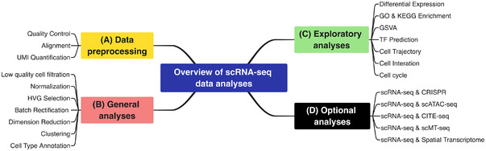

# 10x_sequence_analysis_pipeline

## Pipeline

- download data
    
    - sample fastq
      
    - sample-index list
      
      - [10x genomics sample index list][1]
          
    - barcodes reads whitelist
      
      - [10x genomics barcode whitelist][2]
      
      - kb_python has built-in barcode whitelist. Check supported seq tech use `kb --list`.
     
- download reference data with annotation and pre-built index

    - download and build /w kb_python
    
    - Or download pre-built index /w kb_python
 
      
- Sample Index + UMI + Barcode based sample from original data
    
    - 10x genomics Chromium v2 3' chemical UMI + Barcode position
      
      - sample index -> 8
      
      - CB + UMI -> 16 + 10 (26)
      
      - reads -> 98
    
    - Inspect sample index, UMI and barcode first
      
- Demultiplexing sample index and score-based quality control

    - reformat the sampel index .csv/.json file to meet software-wise requirement

    - Demultiplexing: Cell Ranger's mkfastq or Illumina's bcl2fastq
      
      - for now demultiplex python software
    
- Align(or align free), barcode + UMI extraction, Quantification (/w kb_python)
    
    - 10x genomcis v2 '3: Read 1: 16 + 10(CB + UMI); Read 2: actual sequence
    
    - Filter the UMI + Barcode with quality-score > 10%, not homopolymers and carcode within 1-Hamming-distance. 
    
    - cell call, droplet-based quality control, normalization
    
- PCA analysis, clustering, marker gene extraction, differential analysis(/w scanpy)

## Data

- reference data: 
    - Homo_sapiens.GRCh38.dna.chromosome.X.fa.gz
    - Cell Ranger's config
    - kb's repo
      
- annotation: 
  - Homo_sapiens.GRCh38.109.gtf.gz
  - Cell Ranger's config
  - kb's repo
    

## scRNA Sequence Frameworks

### Cell Ranger + seurat

### starSolo + MultiQC + DropletUtils + seurat

    - starSolo: Demultiplexing, Alignment, quantification
    
    starSolo is an alternative to Cell Ranger, which integrated cell call pipeline.
    
    - MultiQC: quality report
    - DropletUtils:  quality control(score-based, droplet-based)
    - seurat: downstream analysis(clustering...)
 
    
### salmon(alevin + simpleaf) + scanpy
    
    - alevin + simpleaf: demultiplexing, aligner, quantification
    
    salmon based framwork, features its quick and memory-saving aligner and alignment free
    quantification method.
        
    - scanpy: downstream analysis
      
    scanpy is an alternative scRNA seq analysis Python package to Seurat, which is in R.

### Kallisto + bustools + scanpy

    - kallisto + bustools(kb): demultiplexing, aligner, quantification
    
    kallisto is an fast and alignment-free program for quantifying scRNA-seq data. 
    kb is a workflow for pre-processing scRNA-seq data. It's tutorial is integrated with both
    Python and R code examples. With python api
    
    - scanpy: downstream analysis

        
    
Question:
    How sample index works
    
[1]: https://www.10xgenomics.com/support/single-cell-gene-expression/documentation/steps/sequencing/sample-index-sets-for-single-cell-3
      
[2]: https://github.com/10XGenomics/cellranger/tree/master/lib/python/cellranger/barcodes
